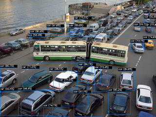

# RPi3_NCS2
Intel Neural Compute Stick 2 Running on RPI 3 with Threading

These Scripts allow you to do Object detection on the Raspberry Pi 3B+ using the Intel Neural Compute stick.
Frame rate for pi_NCS2_USB_cam_threaded_mobilenet.py is around 20 FPS at 320x240. Detection is a little lower than the framerate, but not by much!
Scaling video down to 320x240 seems small, but it is quite viewable and the network input layer is only 300x300 in any case, so bigger is just wasteful.

This pretty decent framerate was achived by moving the blocking operation (net.forward()) is removed to a thread, along with a bunch of related stuff(pre-processing the frame etc).

Follow the instructions here to set up and configure your Pi:
https://software.intel.com/en-us/articles/OpenVINO-Install-RaspberryPI

The following scripts are provided in src/:

**openvino_fd_myriad.py**
Original single image detection script from: https://software.intel.com/en-us/articles/OpenVINO-Install-RaspberryPI
You should build it and run it to verify your OpenCV installation

**pi_NCS_USB_cam_test1.py**
**pi_NCS_USB_cam_test2.py**
Naive initial scripts (experiments), all the work prepping and forwarding is done in the main thread.

**pi_NCS2_USB_cam_threaded_mobilenet.py**
Threaded example using the mobilenet-ssd model, converted from the caffe model using the OpenVino toolkit
The models are present in src/models to save you a job.

**pi_NCS2_USB_cam_threaded_faces.py**
Threaded example using the models from: https://download.01.org/openvinotoolkit/2018_R4/open_model_zoo/
Specifically face-detection-retail-0004

**Note:**
Camera settings are altered using:
cap.set(cv2.CAP_PROP_FRAME_WIDTH, frameWidth)
cap.set(cv2.CAP_PROP_FRAME_HEIGHT, frameHeight)
cap.set(cv2.CAP_PROP_FPS, framesPerSec)

Check what your camera is capable of if you get errors, some cameras do FPS in mutiples of 10, some use multiples of 6!
Setting a camera to say 25 fps when it expects either 20 or 30 will cause the script to bomb out.

***ALSO:***
If you suddenly get a terrible framerate, try turning the lights up! My USB cam at least, throttles its own framerate if lighting is poor, presumably it perfroms frame integration in low light(cv2.CAP_PROP_FPS does not seem to report this!).

***UPDATE YOLOv3***
2 scripts have been added with kind permission based on the awesome work of Pinto: https://github.com/PINTO0309/OpenVINO-YoloV3/
Pinto has been playing with NCS and OpenVINO for some time, you should definitelty head on over there!

***yolo_images_test.py***
This script reads an image called in.jpg and shows and writes an image called out.png with bounding boxes and labels:

***yolo_test_threaded***
This script is heavily based on that by Pinto, however I have threaded a couple or parts to allow it to run reasonably on the RPi3B+ and NCS2

Both scripts require the YOLOV3 model, which is available here:
https://drive.google.com/open?id=1fw3O5_13PkjQj2xM2lt8vRzP2VQ_z1a7

